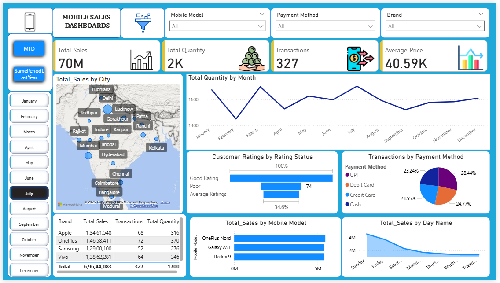
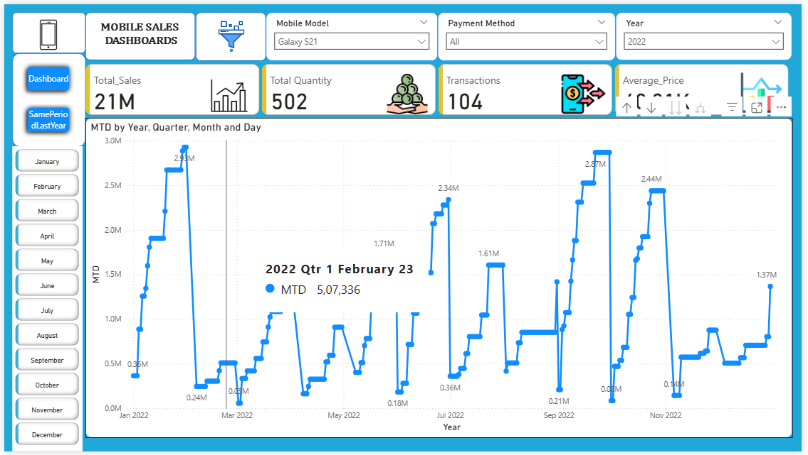
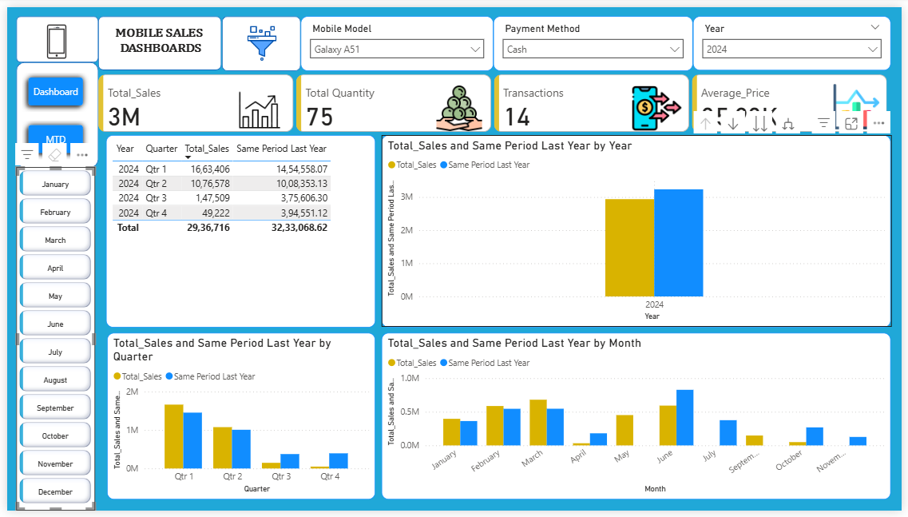

# 📊 Mobile Sales Analysis Dashboard – Power BI

## 📌 Project Overview
This project is an interactive **Power BI dashboard** designed to analyze and visualize mobile sales performance across multiple regions and product categories. It provides clear insights into sales trends, revenue growth, and top-performing products, helping in data-driven decision-making.

## 🎯 Objectives
- Track total sales and revenue trends.
- Identify top-selling mobile products and categories.
- Compare regional sales performance.
- Provide dynamic filters for customized analysis.

## 🛠 Tools & Technologies Used
- **Power BI**
- **DAX (Data Analysis Expressions)**
- **Power Query**
- **Microsoft Excel** (for data source)
- **Data Visualization Techniques**

## 📈 Key Features
- Interactive dashboard with slicers and filters.
- KPIs for Total Sales, Revenue, and Units Sold.
- Sales trend analysis using line charts.
- Top products and regional breakdown.
- Drill-down capability for detailed insights.

## 📷 Dashboard Preview
 

## 📂 Project Files
- `Mobile_Sales_Analysis.pbix`
- `Data.xlsx`
- `README.md` 

## 🔗 Live Demo / Download
[Click here to view or download the Power BI file](YOUR_LINK_HERE)

## 📬 Contact
For queries or collaboration:perweentammna@gmail.com 
LinkedIn: [Your LinkedIn Profile](https://linkedin.com/in/yourprofile)
